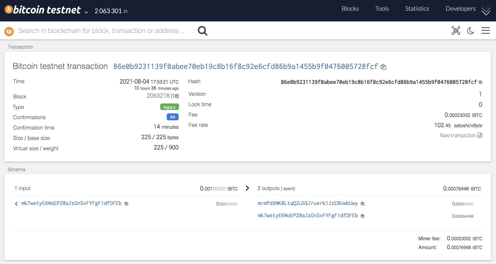

# Assignment_19_Multi_Blockchain_Wallet


---

## Overview 
For this assignment, the focus was to build a portfolio management system that supports multiple crypto assets including BTC, ETH and others.  The following report outlines how to build HD Wallets that support BIP32, BIP39, BIP44 and other non-standard derivation paths. Once the wallets are setup, you will also be able to send various transactions on a custom network and/or through the testnets. 

## Dependencies

The following dependencies are required for this assignment:

 * HD Wallet Derive Installation Guide
 * Blockchain TX Installation Guide.


**Dependencies List:**

* PHP must be installed on your operating system.
* You will need to clone the hd-wallet-derive tool.
* bit Python Bitcoin library.
* web3.py Python Ethereum library.


## Step 1 - HD-WALLET-DERIVE INSTALLATION
The first step is to create a project directory called `wallet` to store all the files required to create your `HD-Wallet`. Once the file is created navigate to it in terminal and follow these steps:

* Clone the `hd-wallet-derive` tool into this folder and install it using the HD Wallet Derive Installation Guide
 
* Create a symlink called `derive` for the `hd-wallet-derive/hd-wallet-derive.php` script. 

* Next we can run the following code

```bash
ln -s hd-wallet-derive/hd-wallet-derive.php derive
```

* In order to check that the `./derive` script runs properly, input the following code:

```bash
./derive --key=xprv9zbB6Xchu2zRkf6jSEnH9vuy7tpBuq2njDRr9efSGBXSYr1QtN8QHRur28QLQvKRqFThCxopdS1UD61a5q6jGyuJPGLDV9XfYHQto72DAE8 --cols=path,address --coin=ZEC --numderive=3 -g
```
* The output should match the following:


## Step 2 - Create Python Scripts

* Next we will need to create a universal wallet script called `wallet.ipynb`. Note - That we used a Jupyter Lab notebook to run our python wallet functions. Alternatively, we can create a python `wallet.py` script to run our functions directly in terminal.    

* In a seperate file called `constants.py`, setup the following constants:

    * `BTC = btc`
    * `ETH = eth`
    * `BTCTEST = btc-test`

## Step 3 - Create Python Scripts

* Generate a new 12 word mnemonic using `hd-wallet-derive` or by using this https://iancoleman.io/bip39/.


* Set this mnemonic as an environment variable by storing it in a `.env` file and importing it into your `wallet.py`.

## Step 4 - Derive Wallets Function
Create a function called `derive_wallets`. See jupyter lab script.


## Step 5 - Account Object Function
Create a function called `priv_key_to_account` that converts privkey strings to account objects. See jupyter lab script.

## Step 6 - Unsigned Transaction Function
Create a function called `create_tx` that creates an unsigned transaction appropriate metadata. See jupyter lab script.

## Step 7 - Send & Sign Transaction Function
Create a function called `send_tx` that calls `create_tx`, signs and sends the transaction. See jupyter lab script.


## BTC Transaction
Now that your wallets and scripts are setup, we can try sending some test bitcoin. 

* First, fund a `BTCTEST` address using a testnet faucet (https://testnet-faucet.mempool.co/). 

* Then use the `send_tx` to send some `BTCTEST` to another testnet address.

* You can go to Block Explorer (https://tbtc.bitaps.com/) to verify your transaction using your wallet address or transaction hash.

    * Below is the transaction details for sending 0.0001 BTC between the first derived address and second derived address from my `HD-Wallet`

    

## ETH Transaction
We can also do a Proof of Authority Ethereum Transaction between our derived wallet addresses. 

* Create a new PoA blockchain and pre-fund the `ETH` derived addresses from `HD-Wallet`. 

* Once this is setup, use the `send_tx` to send some `ETH` from your pre-funded address to another derived address.


* We can verify the transaction was succesful by going to  `Check TX Status` in `MyCrypto` and entering the hash id:

```bash
0x5a7082dfa50d8946c674ce53d7613152399f5cd7001bde105a68eeb8c24f8761
```

* You should see the transaction was `Successful` similar to the below screenshot:


